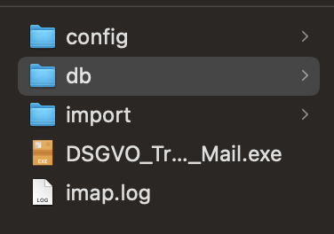
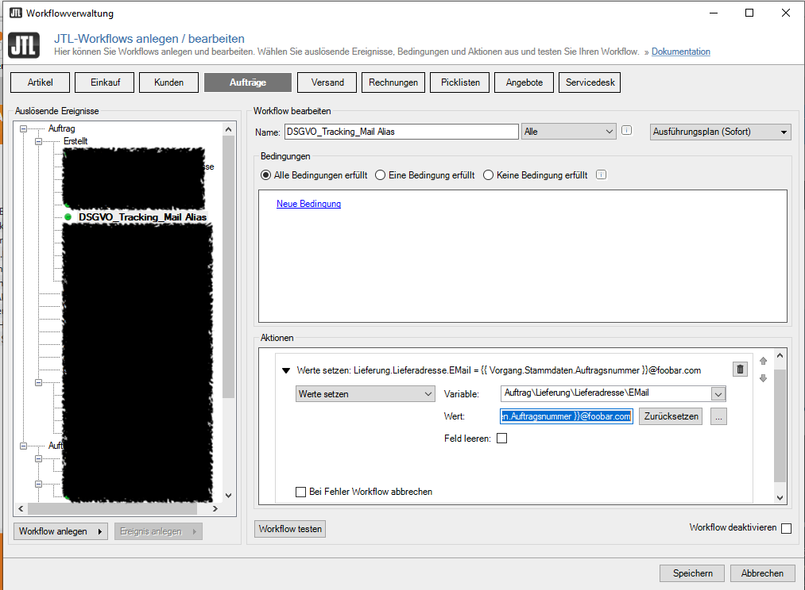
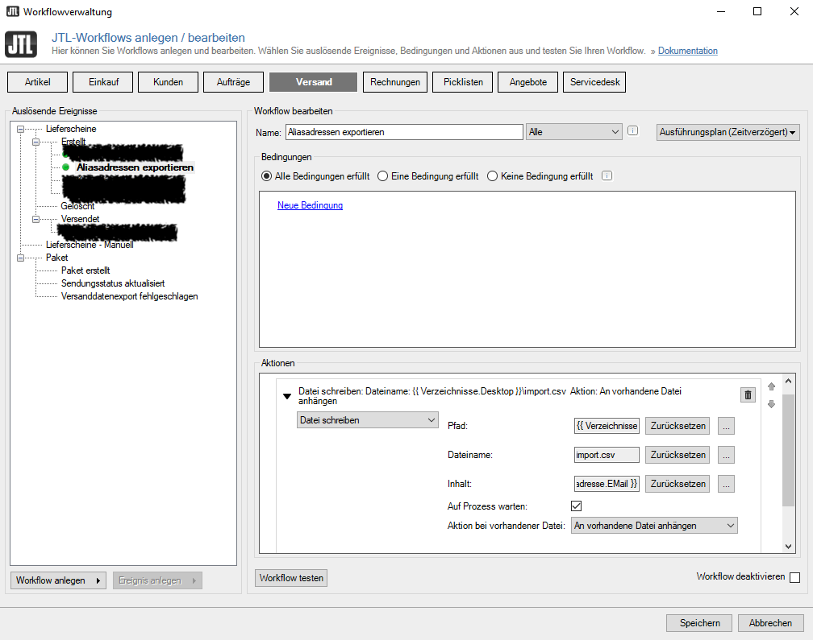

# DSGVO Tracking Mail
Immer mehr Logistiker verlagen heutzutage, dass man bei Erstellung des Versandetiketts eine E-Mail-Adresse des 
Empfängers angibt, an welche er dann eigene Versandbenachrichtigungen senden kann. Das wirft hinsichtlich der DSGVO 
einige Probleme auf, da mann die E-Mail-Adresse nicht ohne Einverständnis des Kunden weitergeben kann/darf.

Dieses Skript umgeht dieses Problem, in dem es pseudonymisierte E-Mail-Adressen an den jeweiligen 
Logistiker weitergibt. 

## Konzept
Im Zuge des Versands wird an den Logistiker nicht die echte E-Mail-Adresse des Kunden übergeben, sondern nur eine  
Alias-Adresse.
Z.B.:```<Auftragsnummer>@foobar.com>```.

Der Logistker versendet dann seine Versandbenachrichtigungnen an diese pseudonyme E-Mail-Adresse (Alias), die in 
einem eigenem IMAP [Catch-All-Mailkonto](https://de.wikipedia.org/wiki/Catch-All) landen. 
Das Skript DSGVO_Tracking_Mail nimmt diese E-Mails und wandelt dann im Nachgang den Alias aus den 
Versandbenachrichtigungne in die richtige des Kunden und leitet sie an den Kunden weiter.


### Detailierte Funktionsbeschreibung
Im Zuge der Versandabwicklung muss eine [csv](https://de.wikipedia.org/wiki/CSV_(Dateiformat)) formatierte Datei geschrieben werden, die ein mapping von echter 
E-Mail-Adresse zum Alias enthält. Dies kann bei z.B. JTL-Wawi über einen Workflow erreicht werden. Sofern die Datei 
bereits existiert können neue Einträge hinzugefügt werden. Ansonsten muss Datei neu erstellt werden.

Das Script wird in intervallen z.B. über einen Cron Job (Linux) oder die Aufgabenplanung (Windows) regelmäßig  
gestartet. Bei jedem Start wird geprüft, ob es eine neue csv Datei gibt. Wenn ja, wird sie in eine Datenbank 
eingelesen. Hierbei muss der Alias eindeutig sein. Sofern er schon in der Datenbank vorhanden ist, wird der Eintrag 
übersprungen.
Nachdem der Alias in die DB geschrieben wurde, wird die csv Datei gelöscht.

Im zweiten Schritt wird das Catch-All-Mailkonto abgefragt, ob neue Versandemails eingegangen sind. Diese werden 
eingelesen und zur SPAM Abwehr einigen Prüfungen unterzogen:
1. **Domian Whitelist**: es kann eine Liste mit erlaubten Domais definiert werden, von welchen E-Mails bearbeitet 
   werden dürfen. Hierzu 
  wird der Domain Teil der "From" Adresse mit der Whiteliste verglichen. Ist diese dort **nicht** enthalten, wird 
  diese Versandbenachrichtigung ignoriert:
   - From: noreply@deutschepost.de  - whitelist: deutschepost.de -> OK
   - From: noreply@deutsche-post.de - whitelist: deutschepost.de -> nicht OK
2. **SPF-Header**: Es wird der [SPF](https://de.wikipedia.org/wiki/Sender_Policy_Framework) Eintrag des E-Mail-Headers 
   überprüft.
   Sollte der Wert nicht einem der folgenden entsprechen ("pass", "Pass", "softfail", "SoftFail", "neutral", "Neutral", 
   "none", "None"), wird diese Versandbenachrichtigung ignoriert

Im dritten Schritt extrahiert das Skript die "To" Adresse (Alias) aus der Versandemail und schaut in der 
Datenbank nach, ob es dazu einen Eintrag gibt. Wenn ja, wird aus diesem Eintrag die richtige E-Mail-Adresse genommen 
und in der Versandemail die "To" Adresse durch diese ausgetauscht. Zudem wird die "From" Adresse auf eine eigene 
gesetzt. Zusätzlich können noch "Bcc" Adressen definiert werden, an welche die Versandbenachrichtigung dann auch 
gesendet wird. Das kann z.B. eine eigene sein, um zu überprüfen, ob, bzw. welche Versandbenachrichtigungen 
weitergeleitet wurden.

Der letzte Schritt versendet dann diese Versandbenachrichtigung über einen smtp Server

###  Housekeeping
Alte E-Mails aus dem Catch-All Postfach, sowie Aliase in der DB werden regelmässig gelöscht. Die Vorhaltezeit 
(retention_period) kann jeweils deffiniert werden.


## Konfigurationsdatei
Die einzige Konfigurationsdatei (config.yaml) ist eine im [yaml](https://de.wikipedia.org/wiki/YAML) Format 
geschriebene Datei und muss in einem Unterverzeichnis ```./config``` liegen. Eine Beispieldatei (config.yaml.example) findet sich hier im Repository.

Sektionen:
``` yaml
LOGGING:
  logfilename: imap.log
  path_to_logfile: ./
  level_file: ERROR     # zur Fehleranalyse kann der Level zB auf DEBUG gesetzt werden
  level_screen: ERROR   # zur Fehleranalyse kann der Level zB auf DEBUG gesetzt werden
  filesize: 10000000
  filecount: 5
 
# Parameter zum Catch-All Postfach - Werte bitte beim Provider erfragen
IMAP:
  host: <IP-Adresse or FQDN>
  username: <Benutzername>
  password: <Passwort>
  ssl: True
  tls: False
  port: 993
  retention_period: 60  # wie lange in tagen werden E-Mails vorgehalten, bevor sie geloescht werden

# Parameter zum Versenden der E-Mails - Werte bitte beim Provider erfragen
SMTP:
  host: <IP-Adresse or FQDN>
  username: <Benutzername>
  password: <Passwort>
  ssl: False
  tls: True
  port: 587

# Hier werden Daten für die Weiterleitung der E-Mails definiert
FORWARD:
  from: <E-Mail Adresse, die als Absender benutzt werden soll>
  
  # liste von E-Mail Adressen, an welche die E-Mail als BCC gesendet werden soll
  # jede Adresse in separater Zeile mit '-' vorangestellt
  bcc:
    - <E-Mail Adresse, and welche die E-Mail als BCC gesendet werden soll>
    - <weitere E-Mail Adresse, and welche die E-Mail als BCC gesendet werden soll>
    
  # soll ein check des SPF headers durch geführt werden?
  SPFcheck: True # Mögliche Werte True/False

SQLITE:
  dbname: alias.db
  directory: ./db
  table: alias
  timeout: 5
  retention_period: 60  # wielange in Tagen sollen Einträge in der DB vorgehalten werden, bevor sie gelöscht werden?

IMPORT:
  # Verzeichnis und Dateiname mit den Aliaseinträgen
  filename: import.csv
  directory: ./import

WHITELIST:
  # Liste von Domains, von welchen Versandemails akzeptiert werden. Alle anderen werden verworfen
  allowed_domains:
    - dhl.de
    - paket.dpd.de
    - service.dpd.de
    - parcel.one
    - deutschepost.de
```
## Installation
### Herunterladen der benötigten Dateien
1. Aus dem Releasebereich die aktuelle .exe Datei
2. aus dem Verzeichnis src/config config.yaml.example 

### Installation auf dem Server
1. Skripverzeichnis auf dem PC/Server erstellen:
2. .exe dort hinein kopieren
3. Unterverzeichnis ```config``` erstellen
4. ```config.yaml.example``` in das gerade erstellte Unterverzeichnis kopieren und nach ```config.yaml```umbenennen
5. ```config.yaml``` im Editor (am besten Notepad++) öffnen und die Parameter entsprechend anpassen


Finale Verzeichnisstruktur:
- ```config``` enthält die Konfigurationsdatei und muss manuell angelegt werden
- ```db``` hier wird die Datenbank abgelegt. Das Skript erstellt es
- ```import``` hier liegen die Importdaten mit den Aliasen. Das Verzeichnis muss manuell oder durch die 
  exportierende Applikation (JTL-Wawi) angelegt werden. Es kann grundsätzlich auch woanders auf der HD liegen. Der 
  genaue Pfad muss mit der Konfiguration in der ```config.yaml``` übereinstimmen



### Import Datei erstellen
Die Datei mit den E-Mail Aliasen muss im [csv](https://de.wikipedia.org/wiki/CSV_(Dateiformat)) Format geschrieben sein.
Das Trennzeichen muss ein ',' (Komma) sein und folgende Struktur haben:
```csv
<Kunden E-Mail-Adresse>,<alias@catch-all-postfach.de>
```

Beispieldatei:
```csv
foo@foobar.com,AU-2022-12345@mein_catch_all_postfach.de>
```

## Catch-All-Mailkonto
Es sollte zwingend eine eigene (Sub-)Domain für die Versandemails der Logistiker verwendet werden. Die Löschroutine, 
die nach Ablauf der 'retention_period' (siehe config.yaml) alte E-Mails löscht, unterscheidet nicht zwischen 
Versandbenachrichtigungen und sonstigen geschäftlichen E-Mails und löscht alles, sofern die retention_period 
überschritten ist. Bitte beim Provider erkundigen, wie man die Ctach-All Funtkionalität einschaltet

#### IMAP
Das Catch-All-Mailkonto muss zwingend über IMAP angesprochen werden können. POP3 wird **nicht** unterstützt

#### SMTP
Zum Versenden wird eine smpt Serververbindung benötigt

### Erzeugen der Alias Adressen mit JTL-Wawi
Die folgenden Schritte beschreiben wie man mit der JTL-Wawi die Alias-Adressen erstellen kann. Das Skript ist aber 
nicht an die JTL-Wawi gebunden und kann grundsätzlich mit jeder anderen Wawi/Software zusammenarbeiten, sofern die 
erforderlichen Daten bereitgestellt werden können.

1. Workflow für Alias
   - Auslösendes Ereignis: Auftrag / Erstellt
   - Name: DSGVO_Tracking_Mail Alias
   - Ausführungsplan: sofort
   - Bedingung: keine
   - Aktionen: Werte setzen:
     - Variable: Auftrag\Lieferung\Lieferadresse\EMail
     - Wert: {{ Vorgang.Stammdaten.Auftragsnummer }}@foobar.com
     
   - 


2. Workflow für Export des Alias
   - Name: Aliasadressen exportieren
   - Ausführungsplan: zeitverzögert (z.B. 5 Minuten, Workflow wird dann beim nächsten Lauf des Worker ausgelöst)
   - Bedingungen: keine
   - Aktionen: Datei schreiben
   - Pfad: C:\<Pfad wo die Importdatei hingeschrieben werden soll>  **Achtung**: Pfad muss mit der Einstellung in 
     der ```config.yaml``` übereinstimmen
   - Dateiname: import.csv  **Achtung**: Dateiname muss mit der Einstellung in der ```config.yaml``` übereinstimmen
   - Inhalt: ```{{ Vorgang.Auftrag.RechnungsAdresse.EMail }},{{ Vorgang.Auftrag.Lieferadresse.EMail }}```
   - Auf Prozess warten: [X] (Ja)
   - Aktion bei vorhandener Datei: An vorhandene Datei anhängen  


   - 

## Starten des Skripts (Aufgabenplanung)
Das Skript muss in intervallen aufgerufen werden. Es läuft also nicht ständig, sondern nur "on-demand".
Hierzu bietet sich die Windows Aufgabenplanung an. Ob man das Skript einmal Täglich oder jede Stunde ausführen lässt,
i.e. einmal am Tag gebündelt alle Versandemails der Logistiker weitergeleitet werden oder stündlich, ist sicherlich 
"Geschmackssache". Häufiger als halbstündlich ist aber weder sinnvoll, noch anzuraten.


# Fehlersuche
Abhängig vom Logging-level in der Konfigurationsdatei werden Informationen in eine Logdatei ```imap-log``` geschrieben.
```yaml
LOGGING:
  logfilename: imap.log
  path_to_logfile: ./
  level_file: ERROR
  level_screen: ERROR
  filesize: 10000000
  filecount: 5
```
Die ```level_*``` können z.B. auf ```DEBUG``` erhöht werden. Damit werden dann weitere Information über den 
Skriptablauf 
in das Logfile (```level_file```) oder auch auf die Konsole (```level_screen```) ausgegeben. Die Levels können auch 
unterschiedlich gesetzt werden, wenn man z.B. nur mehr informationen im Logfile aber nicht in der Konsole haben möchte 

# Caveat
- **Senden der E-Mails**: Es wird nur einmal versucht E-Mails zu senden, auch wenn beim Senden etwas schiefging und die 
  E-Mail nicht versandt wurde
  - **Workaround**: Im Postfach den Status der E-Mail von "gelesen" auf "ungelesen" setzen. Beim nächsten Skriptstart 
    wird diese E-Mail dann als neu betrachtet und erneut bearbeitet
- **Alias**: Aliaseinträge in der DB müssen Eindeutig sein. Doppelte Aliase werden ignoriert
- **SPF**: es wird nur der SPF Rekord im E-Mail Header ausgewertet und keine extra DNS Abgfrage durchgeführt. Fehlt dieser Header, gilt der SPF-check als passed

# Copy Right
(c) Guido Boehm - alle Rechte vorbehalten

# Lizenz
[GPL v3](https://www.gnu.org/licenses/gpl-3.0.html)